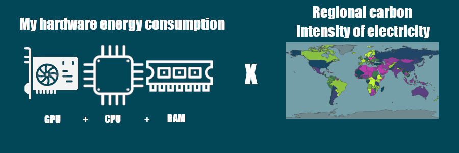

Estimate and track carbon emissions from your computer, quantify and analyze their impact.

[**Documentation**](https://Rahulc26.github.io/codecarbon)

<br/>

[](https://anaconda.org/conda-forge/codecarbon)
[](https://pypi.org/project/codecarbon/)
[](https://zenodo.org/badge/latestdoi/263364731)


- [About CodeCarbon 💡](#about-codecarbon-)
- [Quickstart 🚀](#quickstart-)
    - [Installation 🔧](#installation-)
    - [Start to estimate your impact 📏](#start-to-estimate-your-impact-)
      - [Monitoring your whole machine](#monitoring-your-machine-)
      - [In your python code](#in-your-python-code-)
      - [Visualize](#visualize-)
- [Contributing 🤝](#contributing-)
- [Contact 📝](#contact-)

# About CodeCarbon 💡

**CodeCarbon** started with a quite simple question: 

**What is the carbon emission impact of my computer program? :shrug:**

We found some global data like "computing currently represents roughly 0.5% of the world’s energy consumption" but nothing on our individual/organisation level impact.

At **CodeCarbon**, we believe, along with Niels Bohr, that "Nothing exists until it is measured". So we found a way to estimate how much CO<sub>2</sub> we produce while running our code.

*How?*

We created a Python package that estimates your hardware electricity power consumption (GPU + CPU + RAM) and we apply to it the carbon intensity of the region where the computing is done.



We explain more about this calculation in the [**Methodology**](https://Rahulc26.github.io/codecarbon/methodology.html#) section of the documentation.

Our hope is that this package will be used widely for estimating the carbon footprint of computing, and for establishing best practices with regards to the disclosure and reduction of this footprint.

**So ready to "change the world one run at a time"? Let's start with a very quick set up.**

# Quickstart 🚀

## Installation 🔧

**From PyPI repository**
```python
pip install codecarbon
```

**From Conda repository**
```python
conda install -c conda-forge codecarbon
```
To see more installation options please refer to the documentation: [**Installation**](https://Rahulc26.github.io/codecarbon/installation.html#)

## Start to estimate your impact 📏

To get an experiment_id enter:
```python
! codecarbon init
```
You can now store it in a **.codecarbon.config** at the root of your project 
```python
[codecarbon]
log_level = DEBUG
save_to_api = True
experiment_id = 2bcbcbb8-850d-4692-af0d-76f6f36d79b2 #the experiment_id you get with init
```
Now you have 2 main options:

### Monitoring your machine 💻

In your command prompt use:
```codecarbon monitor```
The package will track your emissions independently from your code.

### In your Python code 🐍
```python
from codecarbon import track_emissions
@track_emissions()
def your_function_to_track():
  # your code
  ```
The package will track the emissions generated by the execution of your function.

There is other ways to use **codecarbon** package, please refer to the documentation to learn more about it:  [**Usage**](https://Rahulc26.github.io/codecarbon/usage.html#)

## Visualize 📊

You can now visualize your experiment emissions on the [dashboard](https://dashboard.codecarbon.io/).


*Note that for now, all emissions data send to codecarbon API are public.*

> Hope you enjoy your first steps monitoring your carbon computing impact!
> Thanks to the incredible codecarbon community 💪🏼 a lot more options are available using *codecarbon* including:
> - offline mode
> - cloud mode
> - comet integration...
>
> Please explore the [**Documentation**](https://Rahulc26.github.io/Victus) to learn about it
> If ever what your are looking for is not yet implemented, let us know through the *issues* and even better become one of our 🦸🏼‍♀️🦸🏼‍♂️ contributors! more info 👇🏼


# Contact 📝

Maintainers are [@Ankit00013](https://github.com/Ankit00013) , [@Rahulc26](https://github.com/Rahulc26) , [@Prateekssu](https://github.com/Prateekssu) and [@Surjyassu](https://github.com/Surjyassu).
